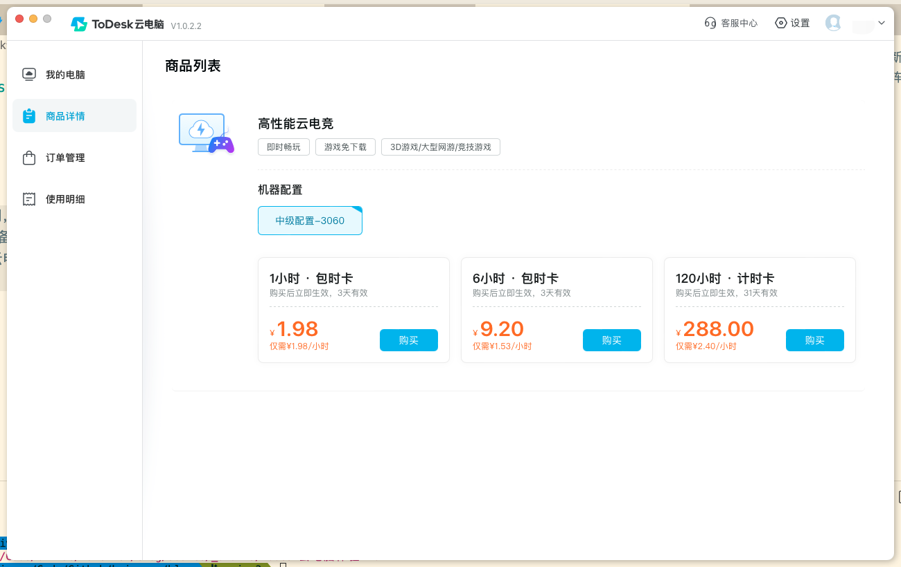
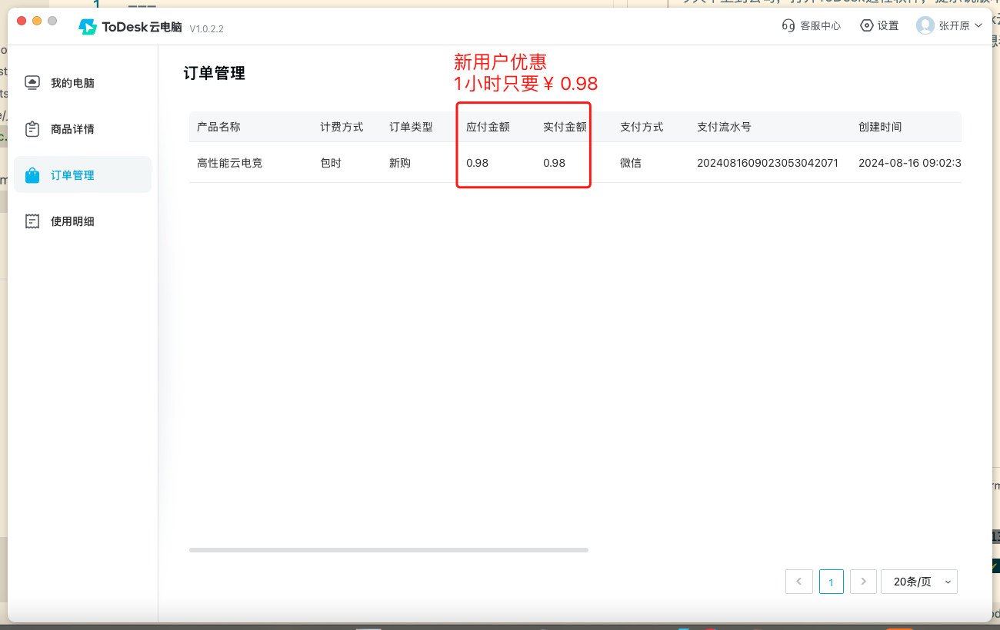
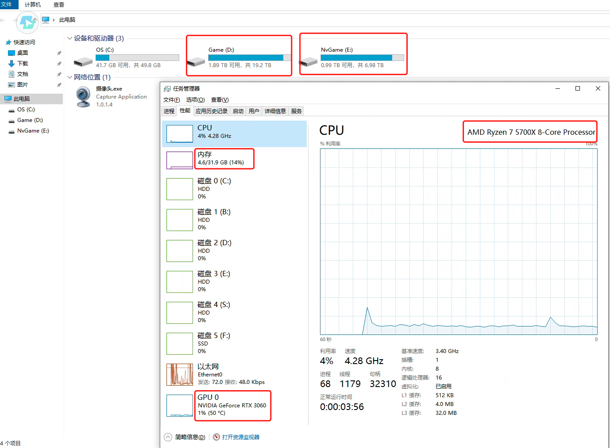
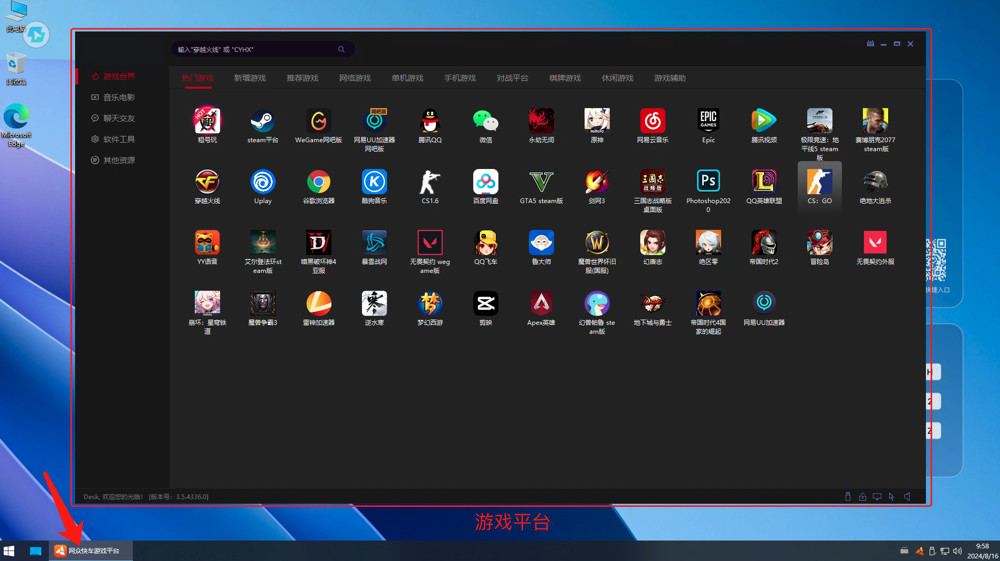
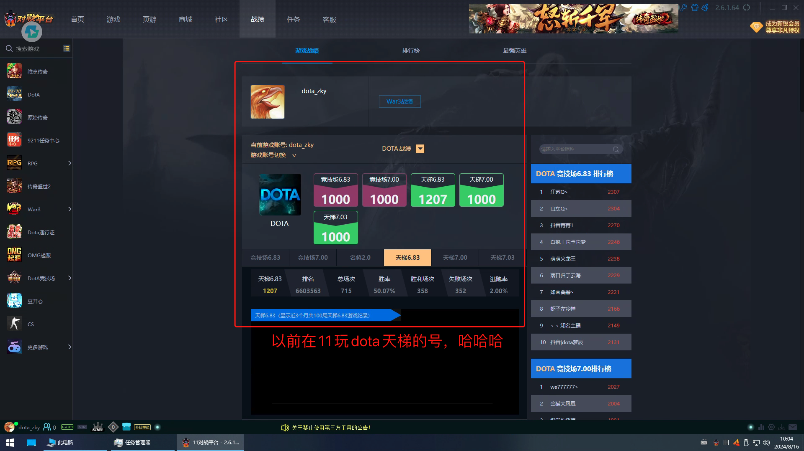

# 过程
今天早上到公司，打开ToDesk远程软件，提示说版本过低，需要更新，然后就到ToDesk官网准备下载，在官网看到有个ToDesk云电脑，因为刚好前阵子试用的[阿里云电脑](https://www.aliyun.com/product/ecs/wuying)今天要到期了，在纠结要不要续费，因为自己偶尔会有使用Windows电脑的需求，想着体验一下ToDesk的云电脑，看看是否有什么不同。

目前提供3种规格：1小时，6小时和120小时，如下图所示。

<!--more-->

新用户有优惠，低至￥0.98/小时，如下图所示。

按照引导新建云电脑，进入系统，可以看到电脑配置挺高。
- CPU: AMD Ryzen 7 5700X 8核心 4.28GHz 
- 内存：32GB
- 硬盘：D盘（19.2TB），E盘（6.98TB）
- GPU：NVIDIA RTX 3060

如下图所示。

为什么硬盘会占用这么多空间，是因为安装了大量的游戏，如下图所示。

这里面有很多经典游戏，有单机也有网游。扫了一下，看到了一个熟悉的魔兽争霸，就想起来以前在11对战平台玩过的dota游戏，就重新登录了一下11对战平台，看过了之前的游戏数据，回想起之前的那段时光，如下图所示。

看来以后可以不用麻烦，跑去网吧了，直接使用云电脑开黑。

# 总结
这种云电脑针对游戏玩家，使用体验不知道会不会比网吧的电脑体验更好，优势是上网费用更低，对本地电脑的配置要求不高，但是对网络延迟应该是有一定要求，不然会影响体验。

